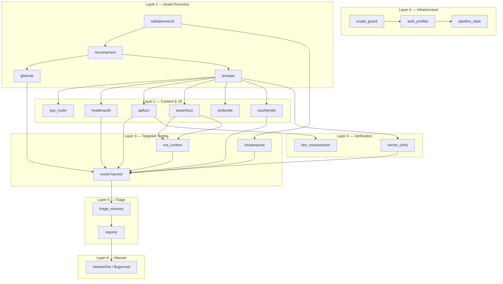

# Bug Bounty Toolkit

Automated reconnaissance-to-triage pipeline for bug bounty hunting. 17 modular scanners driven by a checkpoint-safe orchestrator, from subdomain discovery to interactive finding triage.



## Pipeline in 3 commands

```bash
cp toolkit/configs/scope.example.yaml scope.yaml   # edit your targets
pip install httpx pyyaml
python orchestrator.py --target example.com --deep --scope scope.yaml
```

Output: `work/example.com/<timestamp>/triage_queue.md` — severity-sorted, ready to submit.

## What it does

### Discovery
| Tool | What it finds | Input |
|------|--------------|-------|
| `subtakeover10.py` | Subdomains via CT logs, passive DNS (8 sources), TLS, WHOIS, permutations, CNAME takeover | domain name |
| `reconharvest.py` | Passive enrichment — Wayback URLs, HTTP headers, port scan, IP metadata | subtakeover.json |
| `gitdump.py` | Exposed `.git` repositories — reconstructs source, hunts committed secrets | subtakeover.json |

### Content & JS Analysis
| Tool | What it finds | Input |
|------|--------------|-------|
| `jsreaper.py` | API endpoints, auth tokens, AWS/GCP keys, internal URLs from JS bundles | reconharvest.json |
| `spa_router.py` | Static route-table reconstruction for Next.js/Nuxt/React Router/Vue Router | jsreaper.json |
| `headeraudit.py` | Missing security headers (CSP, HSTS, XFO, COOP, etc.) | reconharvest.json |

### Fuzzing & Probing
| Tool | What it finds | Input |
|------|--------------|-------|
| `4xxbypass.py` | 403/401 bypass via method override, headers, path tricks | reconharvest.json |
| `apifuzz.py` | BOLA/IDOR, mass assignment, JWT `alg: none`, rate-limit gaps | jsreaper.json |
| `paramfuzz.py` | Hidden parameters — debug, privilege, IDOR, pagination | jsreaper.json |
| `ssrfprobe.py` | SSRF via OOB + reflective — metadata endpoints, internal services | jsreaper.json |
| `oauthprobe.py` | OAuth misconfig — redirect URI takeover, state CSRF, token leakage | jsreaper.json |

### Cloud & Infra
| Tool | What it finds | Input |
|------|--------------|-------|
| `cloudexpose.py` | Exposed S3 buckets, Firebase DBs, Azure blobs, GCP storage | subtakeover.json |

### Verification
| Tool | What it finds | Input |
|------|--------------|-------|
| `xss_context.py` | Context-aware reflected XSS verification (payload fires or not) | paramfuzz.json |
| `idor_crosssession.py` | Cross-session BOLA proof — needs 2 auth profiles | apifuzz.json |
| `secret_verify.py` | Provider-side liveness check for harvested secrets | jsreaper.json |

### Aggregation & Triage
| Tool | What it finds | Input |
|------|--------------|-------|
| `nuclei-harvest.py` | Master aggregator — dedup, chain detection, bounty report generation | All stage outputs |
| `triage_memory.py` | Interactive finding triage with H1/Bugcrowd writeup generation | nuclei-harvest.json |

### Additional
| Tool | What it finds |
|------|--------------|
| `graphql_deep.py` | GraphQL schema recovery, introspection, batching/depth abuse |
| `upload_probe.py` | File upload abuse — polyglot, path traversal, MIME bypass |
| `apk_static.py` | Android APK static analysis — exported components, hardcoded secrets |
| `anomaly_baseline.py` | Response-size distribution baseline for anomaly detection |
| `oob_catcher.py` | Self-hosted interact.sh OOB callback server for blind SSRF/XXE |
| `watch_daemon.py` | Continuous monitoring — diffs each scan, alerts on new signal |

## Pipeline modes

| Mode | Stages | Runtime | Use case |
|------|--------|---------|----------|
| `--quick` | 6 | ~5 min | Initial recon, re-scans |
| `--deep` | 20 | 30–90 min | Full attack surface coverage |
| `--resume` | varies | varies | Continue from last checkpoint |
| `--watch` | varies | continuous | Monitor for new assets (cron replacement) |

`python orchestrator.py --target example.com --deep --scope scope.yaml`

On any stage failure, the orchestrator skips to the next non-dependent stage rather than aborting. Use `--resume` to retry only the failed stages.

## Configuration

### scope.yaml (mandatory)
```yaml
program: bug-bounty-toolkit
scope:
  includes:
    - example.com
    - "*.example.com"
  excludes: []
rate_limit:
  max_rps: 10
  max_concurrent: 5
```

Every tool calls `scope_guard.check_scope()` before each request. Out-of-scope targets are logged to `blocked.log` and skipped immediately.

### auth_profiles.yaml (for IDOR verification)
```yaml
profiles:
  user_a: { cookies: { session: "..." }, bearer: "..." }
  user_b: { cookies: { session: "..." }, bearer: "..." }
```

Required by `idor_crosssession.py` for BOLA verification. Optional for all other stages.

## Requirements

- **Python 3.9+** (stdlib + httpx + PyYAML)
- Tested on: Linux (x86_64, ARM64), Termux (Android)
- Optional: `beautifulsoup4`, `rich` for prettier output
- Optional: `interactsh-client` + `espeak` for OOB alerting (`scripts/start_ish.sh`)

## Output format

Every tool writes a `NormalizedFinding`-compatible JSON with this shape:

```json
{
  "domain": "example.com",
  "findings": [{
    "id": "cloudexp_92115",
    "host": "testphp.com",
    "type": "S3_LIST",
    "severity": "HIGH",
    "confidence": "candidate",
    "evidence": "GET ... → HTTP 200 Body: ...",
    "curl_command": "curl -s https://testphp.com.s3.amazonaws.com/",
    "impact_tier": "P1",
    "payout_range": "$100–$2,000"
  }],
  "host_reports": [...]
}
```

`nuclei-harvest.py` aggregates all stage outputs, deduplicates, detects attack chains, and generates:
- `final.json` — master findings
- `final.html` — interactive dashboard
- `final.csv` — remediation tracker
- `final-reports/` — per-finding bounty writeups

`triage_memory.py` walks through findings interactively, lets you review/submit/reject each, and generates HackerOne-formatted writeups.

## Test suite

```bash
pip install httpx pyyaml pytest
python -m pytest toolkit/tests/ -v
```

139 tests covering unit + integration paths with a mock HTTP server fixture.

## Documentation

- `QUICKSTART.md` — 5-command end-to-end guide
- `WORKFLOW.md` — pipeline architecture, stage details, manual follow-up
- `toolkit/IMPLEMENTATION_NOTES.md` — deviations from original spec with rationale
- Per-tool READMEs in `toolkit/<subdir>/<tool>.README.md`

## Project structure

```
├── orchestrator.py          # Pipeline driver (quick/deep/resume/watch)
├── watch_daemon.py          # Continuous monitoring daemon
├── scope.yaml               # Target scope + rate limits
├── auth_profiles.yaml       # Test identities
├── QUICKSTART.md
├── WORKFLOW.md
├── scripts/
│   ├── subtakeover10.py     # Subdomain takeover scanner
│   ├── reconharvest.py      # Passive recon enrichment
│   ├── gitdump.py           # .git repository extraction
│   ├── jsreaper.py          # JS asset + secret extraction
│   ├── headeraudit.py       # Security header audit
│   ├── 4xxbypass.py         # 403/401 bypass
│   ├── apifuzz.py           # API fuzzing
│   ├── paramfuzz.py         # Hidden parameter discovery
│   ├── ssrfprobe.py         # SSRF probing
│   ├── oauthprobe.py        # OAuth misconfiguration
│   ├── cloudexpose.py       # Cloud storage exposure
│   ├── nuclei-harvest.py    # Pipeline aggregator
│   └── start_ish.sh         # OOB interaction monitor
├── toolkit/
│   ├── __init__.py
│   ├── configs/             # Example YAML configs
│   ├── infra/               # Infrastructure (scope, auth, pipeline state, findings)
│   ├── infra_ext/           # OOB catcher
│   ├── discover/            # SPA router discovery
│   ├── testers/             # graphql_deep, upload_probe, apk_static, anomaly_baseline
│   ├── verify/              # xss_context, idor_crosssession, secret_verify, triage_memory
│   ├── schemas/             # Pydantic models
│   └── tests/               # 139 pytest tests
└── toolkit/
```

## License

For authorized penetration testing and bug bounty research only. Ensure you have written permission before scanning any target.
